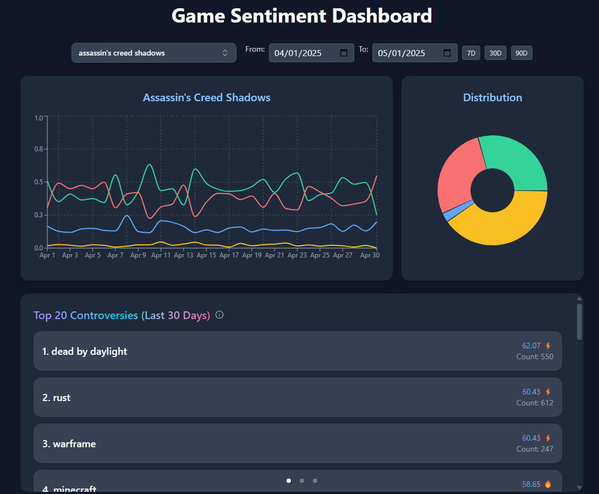
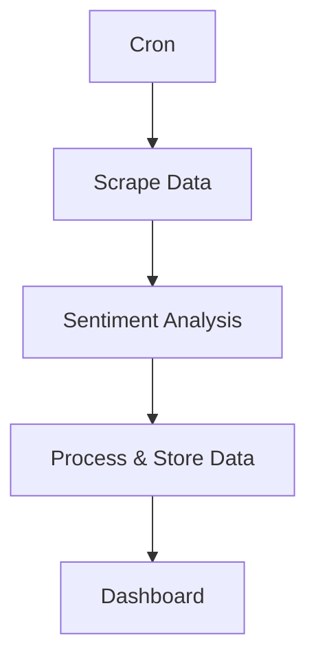
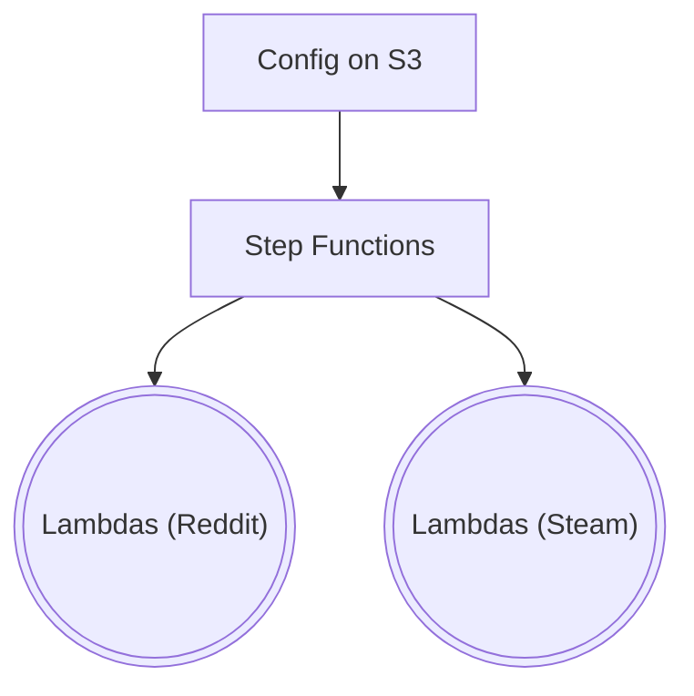
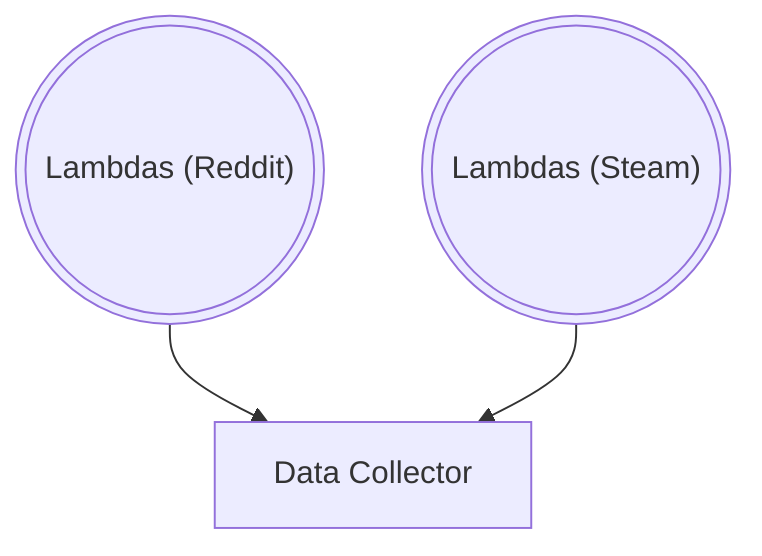
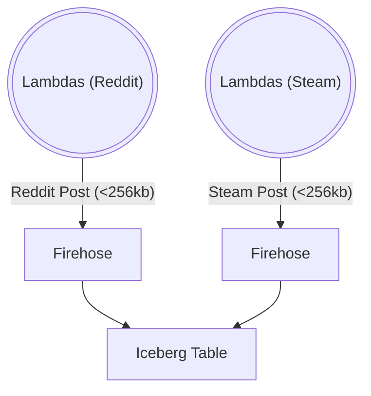
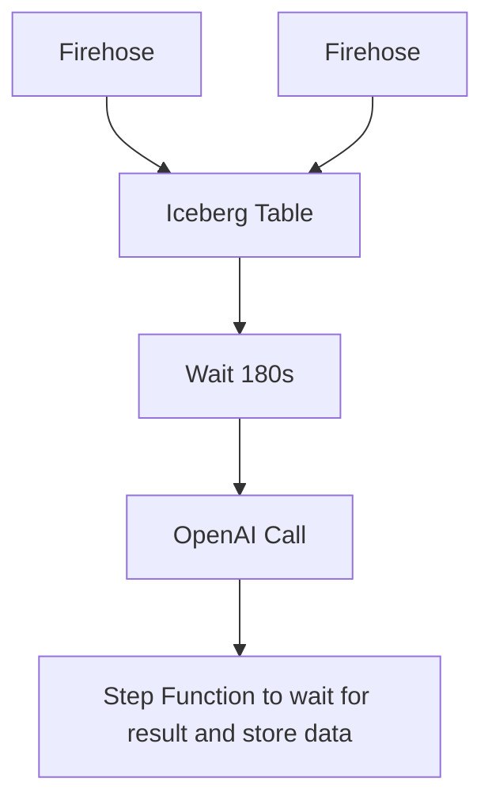
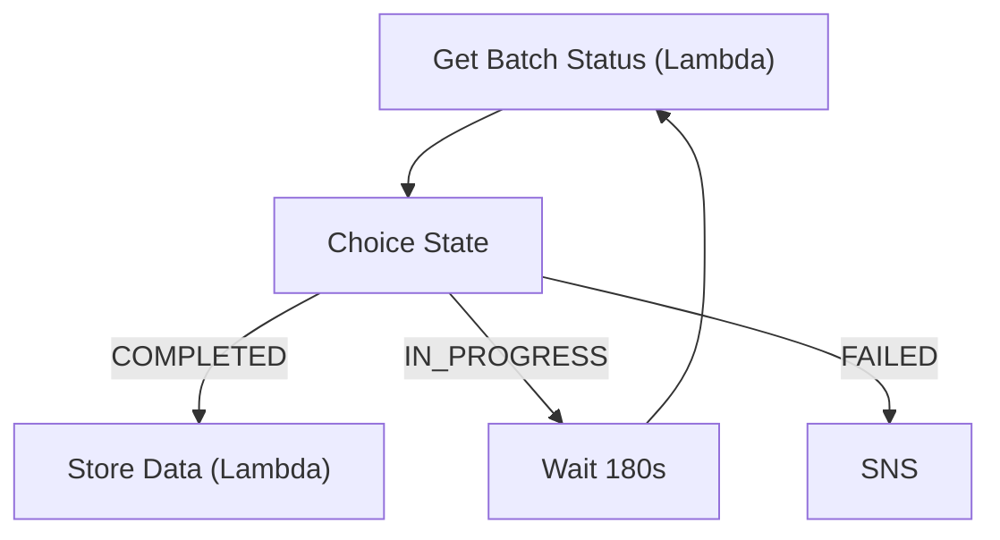
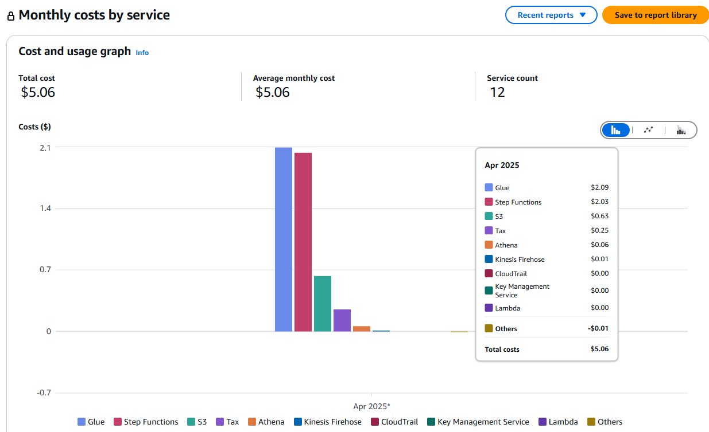
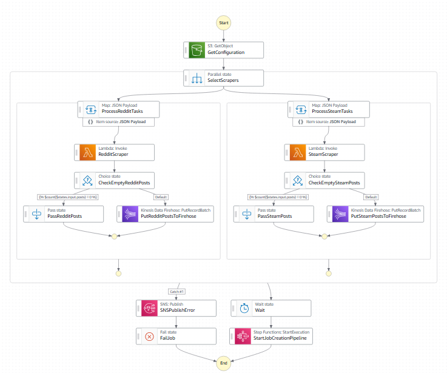
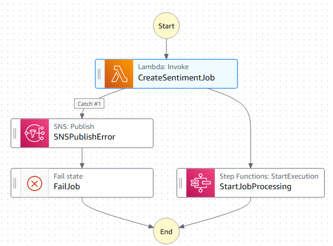

# Hành trình xây dựng Data Pipeline hiện đại trên Amazon Web Services (AWS): Thu thập dữ liệu cảm xúc (Sentiment)

## 0. Preface
Đây là một bài viết chia sẻ về cách thức mình phân tích cảm xúc từ các bài viết, bài review có liên quan tới game từ Reddit và Steam. Mục tiêu cuối cùng là xây dựng một dashboard để trực quan hóa dữ liệu này.

Bài viết này sẽ không "hướng dẫn", tức là sẽ không đi sâu vào từng dòng code mà tập trung vào "phân tích" và nghiên cứu.

## 1. Tại sao lại cần pipeline này?
Trong thời đại dữ liệu, việc hiểu cảm xúc của cộng đồng trên các nền tảng như Reddit, Steam là cực kỳ quan trọng cho phân tích thị trường, sản phẩm. Tuy nhiên, dữ liệu thô từ Internet rất lớn, phân tán, và không đồng nhất. Việc xây dựng một pipeline tự động, tiết kiệm chi phí, dễ mở rộng là điều cần thiết.

Câu trên là do ChatGPT viết, còn thực tế là mình muốn xem thử việc phát triển data pipeline trên AWS có dễ dàng không ☺️. Kết quả sẽ được bật mí ở cuối bài viết.

## 2. Yêu cầu
Trước khi thiết kế, ta phải outline ra một số yêu cầu cơ bản:
- **Dễ mở rộng**: Có thể thêm nguồn dữ liệu mới (Metacritics, Youtube...) mà không cần thay đổi quá nhiều.
- **Tiết kiệm chi phí**: Sử dụng các dịch vụ serverless của AWS để giảm thiểu chi phí vận hành.
- **Không cần real-time**: Dữ liệu không cần được cập nhật ngay lập tức (2 lần/ngày).
- **Dễ bảo trì, sửa lỗi**: Nếu có lỗi xảy ra, cần có cách để dễ dàng chạy lại mà không cần phải tốn thêm tiền.

## 3. Kiến trúc tổng thể

# Cron job: Lên lịch chạy tự động
- Sử dụng AWS **EventBridge Scheduler** để lên lịch chạy tự động cho pipeline này.
- Với tần suất chỉ 2 lần/ngày, giá của nó là miễn phí (free tier).

# Lấy dữ liệu (Scraper)
## Lựa chọn kiến trúc cơ bản
- Để thu thập dữ liệu, cách đơn giản nhất là sử dụng Python API của Reddit (`praw`) và Steam (`request`). Nghĩa là ta cần một "platform" để code. Trên AWS có nhiều lựa chọn như EC2, ECS, Lambda, Glue, Batch...
- Với tính chất "chạy vài lần một ngày, một lần vài phút" của pipeline này, **Lambda** là lựa chọn hiển nhiên để giữ chi phí thấp.

## Vấn đề của Lambda đơn lẻ
- Thư viện `praw` của Reddit cực chậm, có thể mất hàng phút để search data của theo một keyword. Nếu chạy tuần tự vài trăm lần, chắc chắn sẽ bị timeout (maximum của Lambda là 15 phút).
- Nếu chạy song song (`asyncio`, `JS promise`...) - _có thể_ sẽ nhanh hơn - nhưng memory tăng, dễ bị OOM. Đồng thời, việc quản lý trạng thái (batching, retry, error handling) sẽ phức tạp hơn vì Reddit API có giới hạn rate limit (100 requests/phút). Chắc tôi cũng không cần phải giải thích thêm tại sao đây là giải pháp tệ.

## Giải pháp: Kết hợp với Step Functions
Step Functions là một service của AWS giúp điều phối (orchestrate) các "step" của State Machine - giống như Airflow (AWS cũng có service Airflow MWAA, nhưng không phổ biến và giá cao).
- Ưu điểm:
  * **Step Functions (SF)** giúp bạn điều phối nhiều step chạy song song, retry khi lỗi, tích hợp SNS, và _visualize_ từng job rõ ràng với giá input/output. 
  * Với processing mode [_Distributed Map_](https://docs.aws.amazon.amazon.com/step-functions/latest/dg/state-map-distributed.html), bạn có thể scale lên hàng trăm Lambda chạy song song.
  * Serverless, tính tiền theo số lần thay đổi state hoặc resource, thời gian chạy.
- Nhược điểm: 
  * Limit 1000 concurrent Lambda, limit 15' từng Lambda vẫn apply, nhưng đây không phải là vấn đề lớn với project này.
  * Các step trong SF không thể truyền dữ liệu quá 256kb, nên Lambda cần phải lưu kết quả vào S3 để các step sau có thể đọc.
  * Khó dev: Sử dụng ngôn ngữ lập trình lạ (JSONata thay vì Python).
  * Khó test: Testing các step riêng lẻ chưa được hỗ trợ nhiều, bản thân việc test và dev cũng tốn tiền.

## Lưu ý
Để tiết kiệm chi phí và tăng tốc:
  * Nên giới hạn số lượng bài viết/số text cần lấy, ưu tiên các bài mới nhất hoặc có nhiều tương tác. 
  * Không đặt timeout cao cho Lambda, nếu không lấy được bài viết trong thời gian quy định thì dừng lại và báo lỗi. Đặt threshold chấp nhận lỗi của SF để tránh việc một số Lambda bị lỗi làm fail toàn bộ pipeline.

## Triển khai Scraper
- SF sẽ đọc cấu hình từ file `keywords_config.json` trên S3, sau đó phân chia task cho từng Lambda dựa trên từ khóa và nguồn.
- Mỗi scraper chỉ xử lý một game (keyword) và một nguồn (Reddit, Steam), giúp tinh giản code và thời gian xử lý.

# Phân tích cảm xúc (Sentiment Analysis)
## Lựa chọn kiến trúc cơ bản
Sentiment Analysis là một bài toán NLP (Natural Language Processing) phổ biến. Có nhiều cách để thực hiện như:
- Sử dụng mô hình đã được huấn luyện sẵn (pre-trained model):
  * Đặt mô hình ở S3, sử dụng Glue/EMR để chạy Spark Job (tốn $$$)
  * Sagemaker (tốn $$$$)
- Sử dụng AWS Comprehend.
- Sử dụng LLM (Large Language Model) như OpenAI, Gemini...  
  => **ChatGPT 3.5 Turbo** là lựa chọn tốt nhất.

> **AWS Comprehend vs OpenAI**  
> Mình đã thử qua cả 2, AWS Comprehend _thua hoàn toàn_, từ giá cả đến chất lượng, kết quả không chính xác (đặc biệt là khi phân tích các bài đậm chất _sarcasm_ từ Redditors).

## OpenAI Batch
- Để tối ưu hóa chi phí, mình sử dụng [batch API](https://platform.openai.com/docs/guides/batch): Cho phép gửi nhiều bài viết trong 1 request, và kết quả sẽ về trong vòng 24 tiếng (sẽ có trường hợp hiếm mà batch bị timeout sau 24 tiếng và fail, đây là lý do tại sao pipeline cần khả năng retry từ lỗi).
- Batch API có giá bằng 50% so với real-time API, rất thích hợp với ETL pipeline.
- Prompt của mình yêu cầu LLM trả về dạng JSON với điểm số cho các trường `positive`, `negative`, `neutral`, `mixed` (idea này xuất phát từ hệ thống đánh giá của Comprehend).

## Vấn đề của Batch API
Batch mode tạo ra khó khăn về mặt kỹ thuật, vì giờ đây ở SF ta cần một cách để "gom" dữ liệu từ s3 đã lưu từ các step trước, để "đóng gói" gửi lên OpenAI.

Một số cách tôi đã thử:
* Lambda: Tuy giá thành thấp, nhưng `for loop` hơn ngàn s3 object rất chậm (hơn 10 phút).
* Glue: Tốn $$$, và nếu dùng Glue để chạy Spark Job thì nên dùng tool này xuyên suốt ngay từ đầu.

## Giải pháp: Firehose + Iceberg Table
**AWS Firehose**: Stream dữ liệu trực tiếp từ Lambda Scrapers vào S3 dưới định dạng Iceberg table. Sau đó ta có thể dùng Athena query dữ liệu trực tiếp. Firehose có giá thành rất thấp, được tích hợp sẵn với Step Functions, và đặc biệt là mình không cần phải viết nhiều code. Firehose có thể tích hợp data transformation.

**Iceberg table**: định dạng bảng columnar hiện đại của Apache, hỗ trợ tự động partition, schema evolution, sử dụng Glue Catalog, query hiệu quả trên S3 với Athena.

Đây là luồng của SF khi dùng Firehose:

## Lưu ý
- Do Firehose là near real-time (gom data theo từng interval hoặc đạt tới ngưỡng buffer), ta cần config một con số đủ cao để số lượng S3 object tạo ra không quá nhiều nhằm tiết kiệm chi phí. Ở project này tôi dùng con số interval là 3 phút và buffer là 64MB.
- Khi dùng Firehose đổ dữ liệu vào S3 dưới dạng Iceberg, sẽ phát sinh thêm một khoản chi phí nhỏ cho việc tạo và quản lý các partition (Glue Catalog). Nếu muốn cắt khoản này, ta có thể lưu thô vào S3 (tự quản lý partition và catalog).
- SAM (Serverless Application Model) chưa thể tự tạo Glue Catalog cho Iceberg table, nên ta cần tạo thủ công trước khi deploy.

## Triển khai Sentiment Analysis
- Đặt timeout một khoản thời gian lớn hơn interval của Firehose để đảm bảo dữ liệu được gom đủ trước khi được xử lý.
- Khi đã có dữ liệu trong Iceberg table, ta dùng Lambda để đọc dữ liệu (bằng Athena) và gửi batch lên OpenAI.
- Kickoff một Step Function mới để chờ kết quả.

# Đợi kết quả và lưu dữ liệu
## Lựa chọn kiến trúc cơ bản
Step Functions có thể chờ kết quả bằng cách tạo một vòng lặp vô tận để gọi Lambda kiểm tra trạng thái batch.

Kết hợp kết quả trả về từ OpenAI và dữ liệu thô từ nguồn, ta có thể lưu vào một table mới dùng cho dashboard.

Table này cần khả năng đọc (read) ổn, và hỗ trợ filter, sort, group theo nhiều trường. Có nhiều công nghệ làm tốt điều này như:
- AWS RDS
- AWS Redshift
- Supabase
- ...

Nhưng để giữ cho giá thành thấp nhất, thì **Iceberg** trên S3, kết hợp với **Athena**, vẫn là lựa chọn tốt, mặc dù tốc độ đọc có thể chậm hơn.

> Athena chỉ có thể hỗ trợ 5 concurrent request (soft limit), nhưng đây là đủ cho môi trường OLAP, big data.

## Triển khai Step Function đợi kết quả và lưu dữ liệu

# Dashboard
## Lựa chọn kiến trúc cơ bản
Nói về Dashboard thì có rất nhiều chọn lựa:
- Google Looker Studio
- Metabase
- Superset
- Streamlit
- ...

Nhưng để có được một dashboard đẹp, đầy đủ tính năng, đồng thời _miễn phí_ để share cho người khác, thì **NextJS** + **Vercel** hosting là lựa chọn của mình.

## Triển khai dashboard

Với sự hỗ trợ của AI thì việc phát triển dashboard đã trở thành bước đơn giản nhất trong project này. Cái khó nhất là cách thể hiện dữ liệu để giúp người dùng dễ dàng nhận ra các điểm sáng, tối, và các xu hướng.

Từ dữ liệu sentiment (điểm số positive, negative, neutral, mixed) ta có thể tìm ra được các tựa game được đánh giá cao, và các tựa game được đánh giá thấp, hoặc là định nghĩa ra một điểm số "controversy" để đánh giá độ "drama", hoặc tìm ra những "outlier" bằng Standard Deviation (STDEV)...

# Kết quả
Giá thành để vận hành pipeline cho hơn 100 tựa game trong 1 tháng rơi vào khoảng 9$ (2.700VND / game / tháng):
- 5$ AWS
- 4$ OpenAI

> Glue làm mình hơi bất ngờ (document về pricing của AWS đã khiến mình nghĩ nó rẻ 😭), có lẽ sử dụng Parquet bình thường và tự partition bảng sẽ tiết kiệm hơn dùng Iceberg.

# Đánh giá cá nhân về Data Engineering trên AWS
Đây là lần đầu tiên mình làm việc với AWS, nên:
- Testing rất khó khăn (nhất là với dự án cá nhân).
  * Không nhiều service có free tier, mình "lỡ" dùng thử EMR và lập tức mất hơn 2$.
  * Step Functions tuy mạnh nhưng cực khó test (nhất là các step parallel), mỗi lần sửa là phải chạy lại hết (tốn chút $).
- AWS có rất nhiều service giải quyết các vấn đề giống nhau, nên tìm ra giải pháp mất thời gian (vấn đề về kinh nghiệm).
- Với Cloud, sẽ luôn có giải pháp tối ưu. Nếu làm on-prem, bạn sẽ có xu hướng dùng dao mổ trâu để giết gà (dùng Spark cho mọi thứ).

# Source Code

Đây là State Machine của các bước đã đề cập trong bài viết:
1. 
2. 
3. 

Source của project này: https://github.com/tcd93/sentimental/blob/master/template.yaml

Sau đó:
- `cd ./sentiment_getter/scripts && python create_iceberg_table.py` để tạo bảng Iceberg.
- `sam build` và `sam deploy` để dùng SAM CLI (Cloud Formation) deploy tất cả các service lên tài khoản AWS của bạn.

Source code của web dashboard: https://github.com/tcd93/sentimental_web
